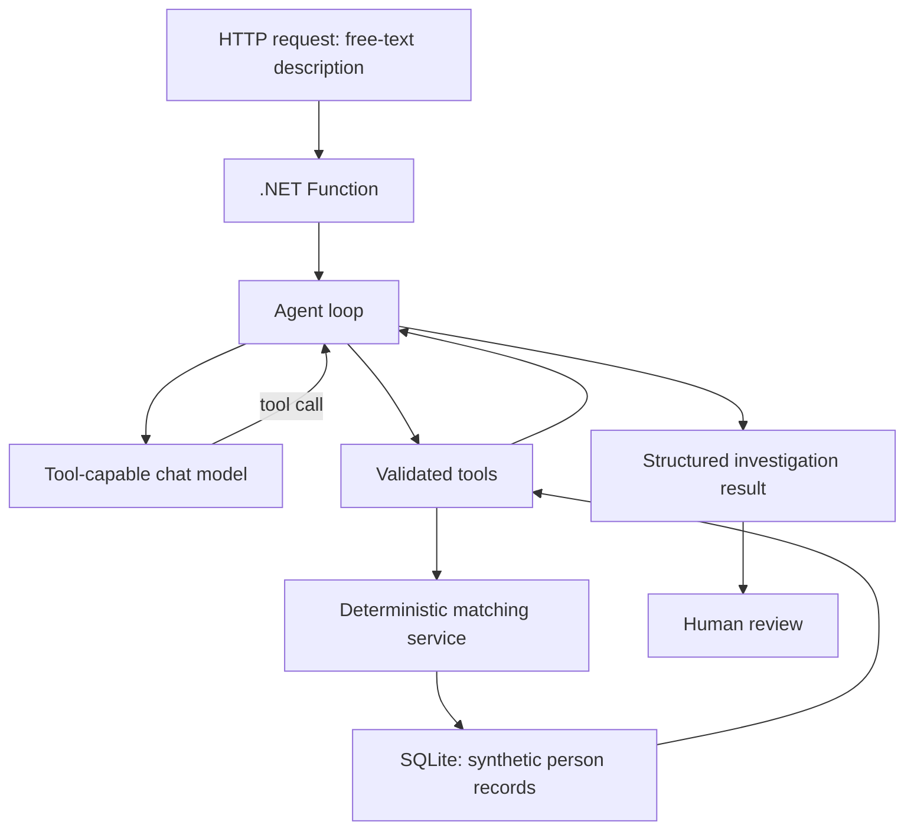

# Burglar Buster

Burglar Buster is a **fictional, educational** identity-resolution and record-triage
application. An operator describes a person they've encountered in free text; an AI
agent turns that description into a structured investigation over a synthetic
database, gathers evidence through a handful of narrowly defined tools, and hands a
human reviewer a ranked, evidence-backed set of candidates to check — never a verdict.

> **This is not a real law-enforcement system.** Every person, address, alias and case
> reference in the database is synthetic and generated for this exercise. The
> application never performs facial recognition or biometric matching, never infers
> guilt, criminality or dangerousness, and never uses protected traits (race,
> ethnicity, religion, health, disability, sexuality) for matching or ranking.
> Physical descriptors like hair colour, eye colour or height are treated as weak,
> supporting evidence only. A result is a **candidate for human verification**, never
> an identity confirmed autonomously by the model — and `no_match` means only that no
> likely record was found, never that someone is "cleared." The agent can search,
> read and compare records, but it can never create, modify, merge or delete one.

## Why this project exists

Most LLM demos either skip the "boring" parts (real business logic, real data, real
failure modes) or bolt an agent onto a vector search and call it done. Burglar Buster
is deliberately the opposite: the underlying data is relational and structured, the
matching logic is fully deterministic, and the LLM's job is narrow — interpret messy
human language, decide which tool to call next, and explain what the evidence shows.
Everything that actually determines the outcome (scores, thresholds, the final
outcome label) is plain, testable, non-AI code.

That split is the point of the exercise. Concretely, the project is built to explore:

- **Tool/function calling** — the model doesn't answer from memory; it calls typed
  tools (`search_people`, `get_address_history`, `compare_candidates`, ...) and reasons
  over their results.
- **A hand-rolled agent loop** — rather than an off-the-shelf agent framework, the
  request/tool-call/response cycle is implemented explicitly, so every step of "what
  did the model ask for, what did we give back" is visible and controllable.
- **Probabilistic reasoning vs. deterministic logic** — the model decides *which*
  tool to call and *when* to stop; it never invents a match score or an outcome.
  Scoring, thresholds and the final classification are computed by ordinary
  application code and are fully reproducible for the same inputs.
- **Safe access to structured data** — the model never writes or executes SQL. It
  requests structured criteria; the application turns those into parameterized
  queries against a bounded, read-only slice of the database.
- **Bounded agent autonomy** — hard caps on how many turns the model gets, how many
  tools it can call, how many candidates it can investigate in detail, and how long
  the whole thing is allowed to take, with defined behaviour when any limit is hit.
- **Progressive investigation** — the agent starts broad (a name/description search)
  and narrows in only on plausible leads (aliases, address history, physical
  description, case context), rather than pulling everything at once.
- **Explicit exit conditions** — every investigation ends in one of a small, fixed
  set of outcomes (strong candidate, ambiguous, no match, insufficient information,
  conflicting information, potential duplicate, manual review required) — there's no
  open-ended "the model just replies."
- **Structured, auditable responses** — the agent's output is a typed result with
  matched evidence, conflicts and missing data spelled out per candidate, not free-form
  prose asserting a conclusion.
- **Human review as a first-class step** — a human confirms a candidate, rejects the
  field, or asks for more information; that decision is recorded for audit but never
  changes the underlying person data.
- **Testing and evaluating an agentic workflow** — deterministic unit/component/API
  tests run without ever calling a real model (the model is mocked), plus a small,
  repeatable scenario set for exercising ambiguous names, duplicates, prompt-injection
  attempts, and tool-limit edge cases.

## How an investigation flows



Only the model call leaves the machine during local development — the database and
the Function both run entirely locally.

## Status

An Azure Functions host runs locally with a health endpoint, typed/validated
configuration, a SQLite database (via EF Core) seeded with ~1,000 deterministic
synthetic person records on startup, a deterministic matching engine, all 7 strongly
typed tools behind an allowlisted dispatcher, and now a real Azure OpenAI connection
driving a manual agent loop behind `POST /api/investigations`. Implementation is
verified end to end with a scripted fake model client; a live real-model run is the
one thing still pending (needs a locally-supplied API key). This section will be kept
up to date as pieces land.

## Prerequisites

- [.NET SDK 10](https://dotnet.microsoft.com/) (developed against `10.0.302`; isolated-worker
  Azure Functions on .NET 10 has been GA since February 2026)
- [Azure Functions Core Tools v4](https://learn.microsoft.com/azure/azure-functions/functions-run-local)
  (developed against `4.13.0`)
- An existing Azure OpenAI resource with a **tool-capable chat model deployment**
  (endpoint + deployment name + API key). This project does not provision Azure
  resources — you need one available. The agent loop connects via the official
  `OpenAI` .NET SDK pointed at the resource's `/openai/v1` endpoint (not
  `Azure.AI.OpenAI` — see `DECISIONS.md`).
- git

After cloning, run `dotnet tool restore` once to pull in the repo-pinned `dotnet-ef`
tool (only needed if you're authoring EF Core migrations — not required just to run
the app).

## Project layout

```text
src/
  BurglarBuster.Functions/       HTTP functions, configuration, composition root
  BurglarBuster.Core/            domain models, matching, outcome policy, agent loop contracts
  BurglarBuster.Infrastructure/  EF Core, repositories/tool implementations, Foundry client
tests/
  BurglarBuster.Tests/            unit and component tests
  BurglarBuster.IntegrationTests/ optional real-model integration tests
samples/
  evaluation-scenarios.json       deterministic scenario set for evaluating agent behaviour
scripts/
  evaluate.*                      local evaluation runner
```

`samples/evaluation-scenarios.json` and `scripts/evaluate.*` are still placeholders —
they land in Milestone 8.

## Database

On startup, the Function host applies EF Core migrations and seeds the database if
it's empty (`src/BurglarBuster.Infrastructure/Seeding/DatabaseSeeder.cs`), so there's
no manual setup step. Seeding uses a fixed random seed, so the same ~1,000 people are
generated every time on a fresh database.

The dataset mixes:
- ~15 hand-authored fixture records (`BB-0001`–`BB-0015`) covering specific test
  scenarios — see [`docs/fixture-scenarios.md`](docs/fixture-scenarios.md). These IDs
  are internal testing reference only and are never given to the model.
- ~985 randomly generated filler people (`BB-0100` onward) for volume/variety.

To reset the local database, stop the host and delete the SQLite file (path from
`Database__ConnectionString` in your `local.settings.json`, default
`burglarbuster.db` relative to wherever the host process runs from) — it's
regenerated identically on next startup.

Schema changes go through EF Core migrations, authored with the repo-local
`dotnet-ef` tool (`dotnet tool restore` once per clone, then e.g.
`dotnet tool run dotnet-ef migrations add <Name> --project src/BurglarBuster.Infrastructure --startup-project src/BurglarBuster.Infrastructure`).

## Matching engine (no AI yet)

`src/BurglarBuster.Core/Matching/` implements the deterministic, two-stage design from
the spec: a bounded database query retrieves a candidate pool, then pure scoring code
ranks candidates and decides one of the outcomes (`strong_candidate`, `ambiguous`,
`no_match`, `insufficient_information`, `conflicting_information`,
`potential_duplicate`, `manual_review_required`) — see `MatchingPolicy.cs` for the
weights/thresholds and `docs/fixture-scenarios.md` for the scenarios it's proven
against.

There's no agent or tool layer yet, so for now the easiest way to try it is the
**temporary, development-only** `POST /api/dev/search-preview` endpoint (also in
Swagger UI) — post a JSON body shaped like `SearchCriteria`, e.g.:

```bash
curl -X POST http://localhost:7071/api/dev/search-preview \
  -H "Content-Type: application/json" \
  -d '{"givenName":"Daniel","familyName":"Miller","dateOfBirth":"1989-04-12"}'
```

This endpoint is not part of the public API contract and will be removed once the real
`/api/investigations` endpoint exists (Milestone 5) and is no longer needed for manual
testing (Milestone 9 cleanup).

## Tool layer (still no AI)

`src/BurglarBuster.Core/Tools/` and `src/BurglarBuster.Infrastructure/Tools/`
implement the 7 tools from spec §10 — `search_people`, `get_person_record`,
`get_aliases`, `get_address_history`, `get_physical_description`,
`get_case_references`, `compare_candidates` — each strongly typed, bounded, and
callable only through `ToolDispatcher`'s allowlist. `ToolCatalog.cs` holds the JSON
Schema + description the agent loop hands to the model for each one.

You can still call them directly (bypassing the model) via the **temporary,
development-only** `POST /api/dev/tool-call` endpoint (also in Swagger UI) — useful
for isolating whether an issue is in a tool or in the model's tool-call choices:

```bash
curl -X POST http://localhost:7071/api/dev/tool-call \
  -H "Content-Type: application/json" \
  -d '{"toolName":"get_person_record","argumentsJson":"{\"personId\":\"BB-0001\"}"}'
```

`toolName` must be one of the 7 names above; `argumentsJson` is that tool's own
arguments, JSON-encoded as a string. The response's `status` field is one of
`success`/`unknownTool`/`invalidArguments`/`notFound`.

## Agent loop and investigations API

`POST /api/investigations` is the real public endpoint from spec §13 — this is not a
temporary dev endpoint. It builds a conversation from the operator's description plus
the versioned system prompt (`BurglarBuster.Core/Agent/AgentInstructions.cs`), sends
it and the tool catalog to the configured Azure OpenAI chat deployment, executes
whatever tools the model requests, and repeats until the model produces a final
summary or a bound is hit (turns, tool calls, or timeouts —
`BurglarBuster.Core/Agent/AgentLoopOptions.cs`). The **outcome and candidates in the
response always come from the last successful `search_people` result the loop
observed — never from anything the model writes** (see `DECISIONS.md`); the model
only ever supplies a plain-language summary and, optionally, what further information
would help.

```bash
curl -X POST http://localhost:7071/api/investigations \
  -H "Content-Type: application/json" \
  -d '{"description":"A man who said his name was Daniel Miller, born 12 April 1989."}'
```

Every investigation is persisted (`Investigation`/`InvestigationCandidate` tables)
regardless of how it concludes — including timeouts, upstream errors, and malformed
model output — with a `terminationReason` recorded either way. There's no
`GET /api/investigations/{id}` yet (Milestone 6).

## Local secrets

Copy `src/BurglarBuster.Functions/local.settings.example.json` to
`src/BurglarBuster.Functions/local.settings.json` (git-ignored) and fill in your own
`AzureOpenAI__BaseUrl`/`AzureOpenAI__ApiKey`/`AzureOpenAI__ChatDeployment`. Never
commit `local.settings.json` or any real endpoint/key. Without a valid `ApiKey` the
Function host now fails to start (by design — see `DECISIONS.md`), with a clear
`OptionsValidationException` naming the missing field.

## Running locally

```bash
cd src/BurglarBuster.Functions
func start
```

This builds the Function app and starts the host on `http://localhost:7071` by
default. Confirm it's up:

```bash
curl http://localhost:7071/api/health
# {"status":"healthy","timestampUtc":"..."}
```

Swagger UI is available at `http://localhost:7071/api/swagger/ui` (raw OpenAPI document
at `/api/swagger.json`) for browsing/trying endpoints as they're added.

## Running tests

```bash
dotnet test
```

Runs all unit/component tests from the repository root, including
`BurglarBuster.IntegrationTests` — that project's one real-model test self-skips
(passes trivially, no network call) unless `AzureOpenAI__*` environment variables are
set, so this is always safe to run and never calls a real model by default.

To actually exercise the real model once (this incurs cost):

```bash
$env:AzureOpenAI__BaseUrl = "https://your-resource.openai.azure.com/openai/v1"
$env:AzureOpenAI__ApiKey = "..."
$env:AzureOpenAI__ChatDeployment = "gpt-4.1-mini"
dotnet test tests/BurglarBuster.IntegrationTests --filter Category=RealModel
```
