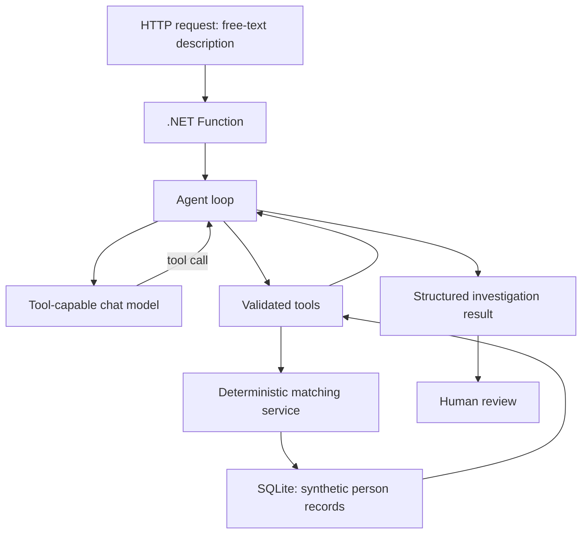

# Burglar Buster

Burglar Buster is a **fictional, educational** identity-resolution and record-triage
application. An operator describes a person they've encountered in free text; an AI
agent turns that description into a structured investigation over a synthetic
database, gathers evidence through a handful of narrowly defined tools, and hands a
human reviewer a ranked, evidence-backed set of candidates to check — never a verdict.

> **This is not a real law-enforcement system.** Every person, address, alias and case
> reference in the database is synthetic and generated for this exercise. The
> application never performs facial recognition or biometric matching, never infers
> guilt, criminality or dangerousness, and never uses protected traits (race,
> ethnicity, religion, health, disability, sexuality) for matching or ranking.
> Physical descriptors like hair colour, eye colour or height are treated as weak,
> supporting evidence only. A result is a **candidate for human verification**, never
> an identity confirmed autonomously by the model — and `no_match` means only that no
> likely record was found, never that someone is "cleared." The agent can search,
> read and compare records, but it can never create, modify, merge or delete one.

## Why this project exists

Most LLM demos either skip the "boring" parts (real business logic, real data, real
failure modes) or bolt an agent onto a vector search and call it done. Burglar Buster
is deliberately the opposite: the underlying data is relational and structured, the
matching logic is fully deterministic, and the LLM's job is narrow — interpret messy
human language, decide which tool to call next, and explain what the evidence shows.
Everything that actually determines the outcome (scores, thresholds, the final
outcome label) is plain, testable, non-AI code.

That split is the point of the exercise. Concretely, the project is built to explore:

- **Tool/function calling** — the model doesn't answer from memory; it calls typed
  tools (`search_people`, `get_address_history`, `compare_candidates`, ...) and reasons
  over their results.
- **A hand-rolled agent loop** — rather than an off-the-shelf agent framework, the
  request/tool-call/response cycle is implemented explicitly, so every step of "what
  did the model ask for, what did we give back" is visible and controllable.
- **Probabilistic reasoning vs. deterministic logic** — the model decides *which*
  tool to call and *when* to stop; it never invents a match score or an outcome.
  Scoring, thresholds and the final classification are computed by ordinary
  application code and are fully reproducible for the same inputs.
- **Safe access to structured data** — the model never writes or executes SQL. It
  requests structured criteria; the application turns those into parameterized
  queries against a bounded, read-only slice of the database.
- **Bounded agent autonomy** — hard caps on how many turns the model gets, how many
  tools it can call, how many candidates it can investigate in detail, and how long
  the whole thing is allowed to take, with defined behaviour when any limit is hit.
- **Progressive investigation** — the agent starts broad (a name/description search)
  and narrows in only on plausible leads (aliases, address history, physical
  description, case context), rather than pulling everything at once.
- **Explicit exit conditions** — every investigation ends in one of a small, fixed
  set of outcomes (strong candidate, ambiguous, no match, insufficient information,
  conflicting information, potential duplicate, manual review required) — there's no
  open-ended "the model just replies."
- **Structured, auditable responses** — the agent's output is a typed result with
  matched evidence, conflicts and missing data spelled out per candidate, not free-form
  prose asserting a conclusion.
- **Human review as a first-class step** — a human confirms a candidate, rejects the
  field, or asks for more information; that decision is recorded for audit but never
  changes the underlying person data.
- **Testing and evaluating an agentic workflow** — deterministic unit/component/API
  tests run without ever calling a real model (the model is mocked), plus a small,
  repeatable scenario set for exercising ambiguous names, duplicates, prompt-injection
  attempts, and tool-limit edge cases.

## How an investigation flows



Only the model call leaves the machine during local development — the database and
the Function both run entirely locally.

## Status

Early stage: the repository, folder layout and configuration scaffolding exist, but
there is no running Function, database or model integration yet. This section will be
kept up to date as pieces land.

## Prerequisites

- [.NET SDK 10](https://dotnet.microsoft.com/) (developed against `10.0.302`; isolated-worker
  Azure Functions on .NET 10 has been GA since February 2026)
- [Azure Functions Core Tools v4](https://learn.microsoft.com/azure/azure-functions/functions-run-local)
  (developed against `4.13.0`)
- An existing Azure AI Foundry resource with a **tool-capable chat model deployment**
  (endpoint + deployment name; API key or Entra ID credential). This project does not
  provision Foundry resources — you need one available before the agent loop can be
  exercised.
- git

## Project layout

```text
src/
  BurglarBuster.Functions/       HTTP functions, configuration, composition root
  BurglarBuster.Core/            domain models, matching, outcome policy, agent loop contracts
  BurglarBuster.Infrastructure/  EF Core, repositories/tool implementations, Foundry client
tests/
  BurglarBuster.Tests/            unit and component tests
  BurglarBuster.IntegrationTests/ optional real-model integration tests
samples/
  evaluation-scenarios.json       deterministic scenario set for evaluating agent behaviour
scripts/
  evaluate.*                      local evaluation runner
```

Project files under `src/`/`tests/` land as the implementation progresses; the folders
exist now as placeholders for the agreed structure.

## Local secrets

Copy `local.settings.example.json` to `local.settings.json` (git-ignored) and fill in
your own Foundry endpoint/deployment/key once the agent loop is wired up. Never commit
`local.settings.json` or any real endpoint/key.
